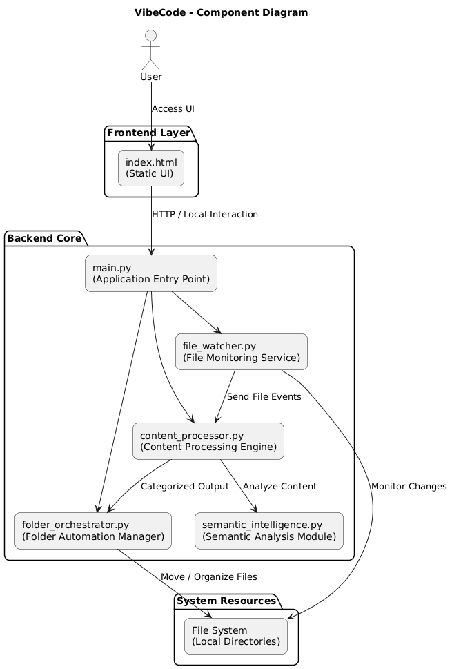
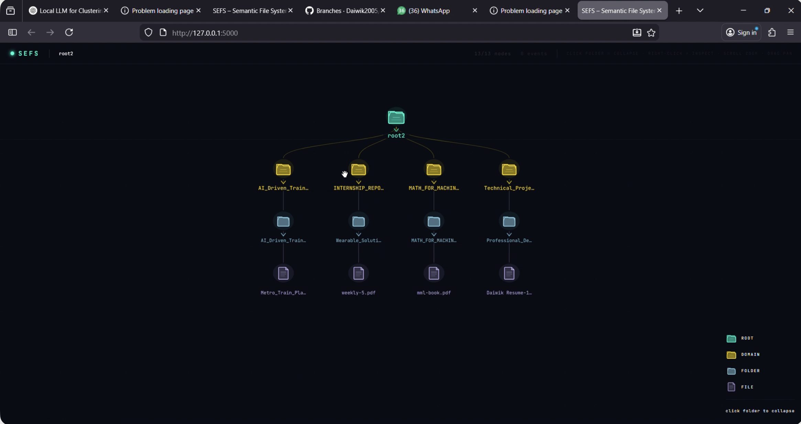
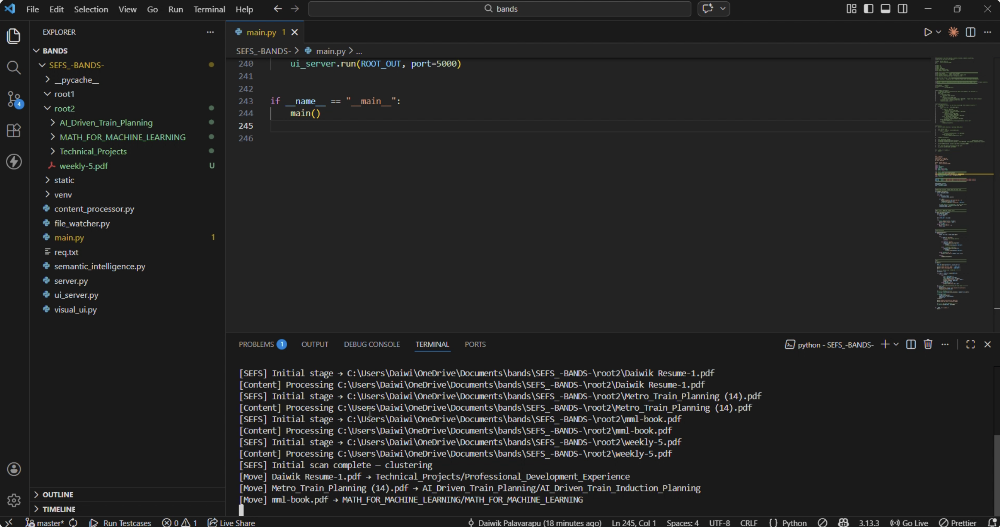

## 📌 Project Title
**Intelligent File Monitoring & Semantic Content Orchestration System**

---

## 🧠 Description

VibeCode is a Python-based automation system that:

- 📂 Monitors file system changes in real-time
- 🧠 Processes file content using semantic intelligence
- 📁 Automatically organizes files into structured folders
- 🌐 Provides a simple frontend interface using static `index.html`

The system follows a modular backend architecture where `main.py` acts as the controller and coordinates file watching, semantic processing, and folder orchestration.

It is designed to be scalable, clean, and easy to extend.

---

## 🏗️ Architecture Diagram 




---

## 🛠️ Tech Stack

- Backend: Python 3.x
- Frontend: HTML (Static)
- Architecture: Modular Python Design
- File Monitoring: Watchdog
- AI Model Runtime: Ollama

---

## 📁 Project Structure

```
VibeCode/
│── main.py
│── content_processor.py
│── folder_orchestrator.py
│── file_watcher.py
│── semantic_intelligence.py
│── req.txt
│
├── static/
│    └── index.html
```

---

# ⚙️ Full Dependency Installation & Setup Instructions

## 2️⃣ Install Python 

Check version:

```bash
python --version
```

Required:
```
Python 3.8 or higher
```

Download from:
https://www.python.org/downloads/

---


## 5️⃣ Install All Project Dependencies

Install from req.txt:

```bash
pip install -r req.txt
```

If needed manually (example):

```bash
pip install watchdog
pip install flask
pip install requests
```
### 🔹 Ollama Installation (Required)

This project uses Ollama to run local LLM models.

1️⃣ Install Ollama from:
https://ollama.com/download

- llama3.2
---

# ▶️ Running the Project

In main.py we should update the root1 and root2 path
```bash
ROOT_IN  = Path(r"C:\Users\Daiwi\OneDrive\Documents\bands\SEFS_-BANDS-\root1")
ROOT_OUT = Path(r"C:\Users\Daiwi\OneDrive\Documents\bands\SEFS_-BANDS-\root2")
```

```bash
python main.py
```

---
# 🌐 Accessing Frontend

If backend serves static content:

```
http://localhost:<PORT>
```

Or open manually:

```
static/index.html
```

---

# 🎥 Demo Section (MVP)

Add your demo links below:

- 🔹 MVP Overview Video: [https://your-demo-link.com](https://drive.google.com/file/d/1d_namX-q9uP4a5Kfi_gZJHFTLJn2tbX4/view?usp=sharing)
-for demonstation purpose root1 and root2 folders have been taken


# 📸 Screenshots 






